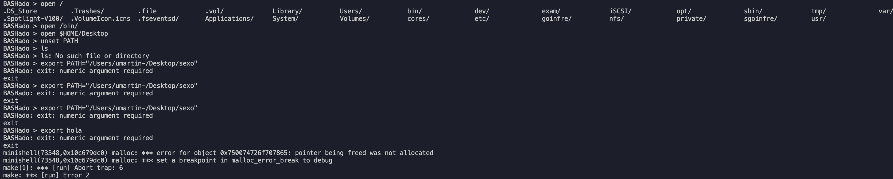
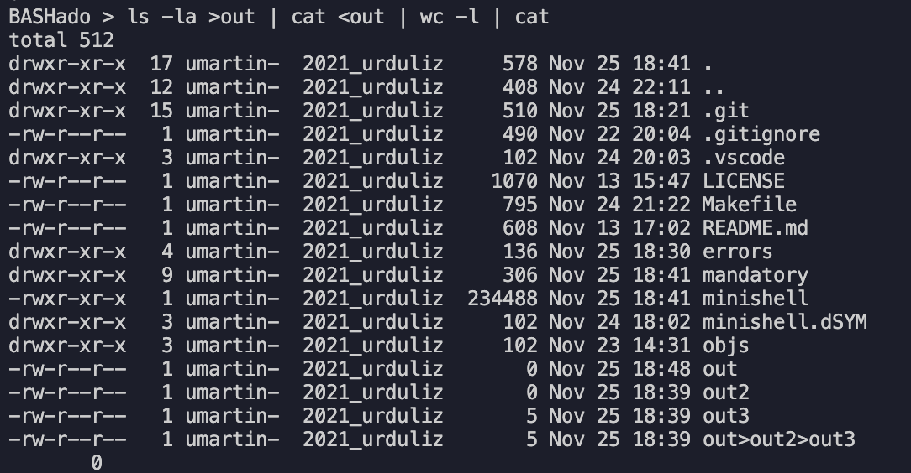

# __ERRORS__

## __Error1__



Primeros abrimos /bin con el comando <code>open /bin/.</code>, luego copiamos todos los binarios que hay dentro, vamos al escritorio y creamos una carpeta en la que vamos a pegar los binarios, <code>cd $HOME/Desktop && mkdir nombre && open nombre</code> y pegas todos los binarios ahi. Hacer <code>unset PATH && export PATH="Users/"tu user"/Desktop/nombre"</code>

## __Error2__

export_utils.c, linea 60 no libera memoria porque  da doble free

<code></code>
```bash
unset PATH
export PATH=algo
``` 

## __Error3__



Con mas de 4 pipes no redirige bien